# Secondary_trading_applet

基于微信小程序的校园二手交易平台

## 校园二手商城微信小程序成果（云开发）
图片看不到可在B站搜索易珠观看效果

### 功能

**（1）用户登陆注册**：在小程序个人主页点击登录或注册，填写相关信息，即可登录或注册，拥有个人账号进行买卖操作。后续也可以修改用户资料。

**（2）用户（卖家）出售商品**：在小程序发布页面，上传商品图片，填写商品各种详细即可发布商品。在个人主页的发布信息中即可查看商品交易信息，可以删除订单，重新上架商品，删除商品。

**（3）用户浏览商品**：商城主页，用户可以通过分类查看各个商品信息，也可以搜索商品名，得到筛选后的商品。点击商品进入商品详情页，可查看商品详细信息。

**（4）用户（买家）购买商品**：在商品详情页，买家可点击立即购买，预定这个商品，可在个人主页的购买信息中查看自己的购买记录，也可以在放弃购买时删除该订单，或在收到商品交易达成后，点击确认收货。交易完成。

**（5）用户交流**：买家可在商品详情页点击聊天与卖家进行沟通。在个人主页的消息中心中，都可以查看聊天信息，进入聊天室。

### 用户操作举例

首先进入小程序进行登录授权，授权进入后，显示商城主页，当前为未登陆注册状态不能发布和购买商品。

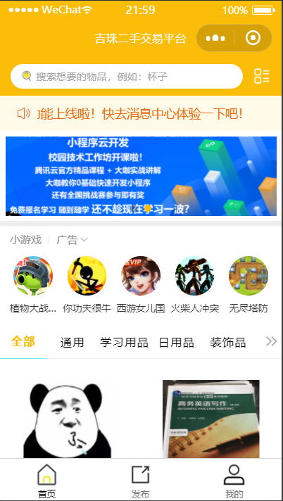 

点击下方导航栏‘我的’进入个人主页，点击**登录**，填写信息，注册或登录账号，登录注册成功，个人主页显示用户微信头像及昵称

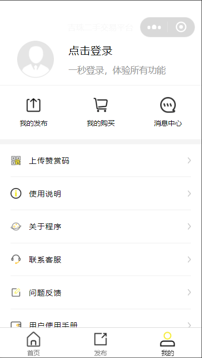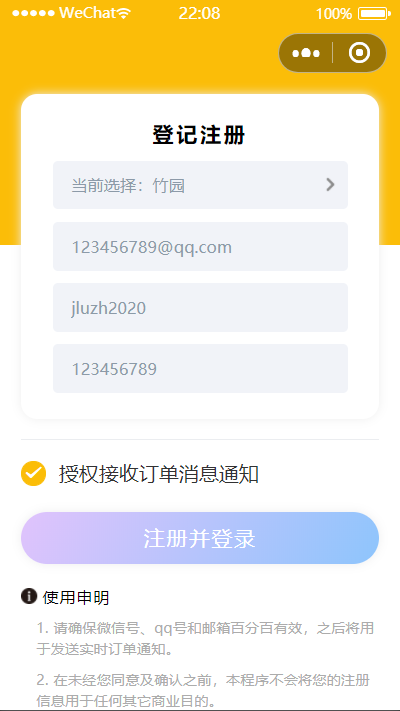

用户想要**出售商品**，可在商城主页导航栏点击‘发布’，填写信息发布商品，在个人主页我的发布中查看出售情况，如不想出售也可在我的发布处点击删除，商品下架。

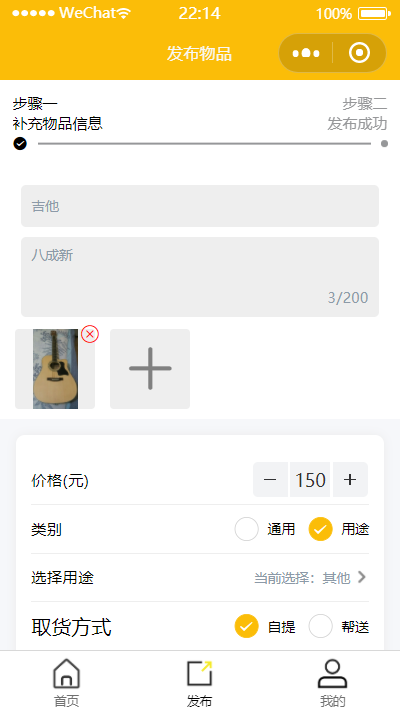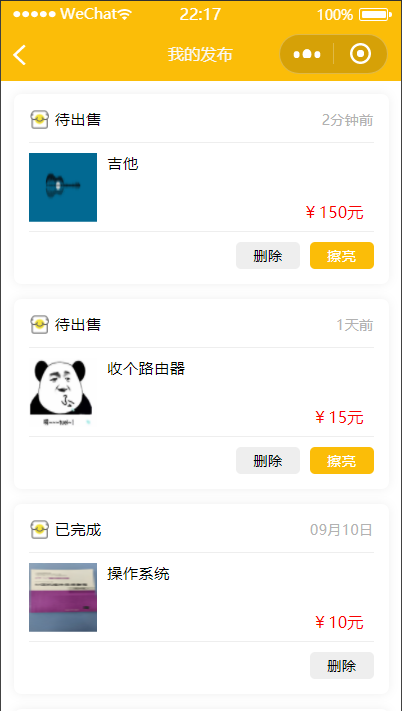

用户想要**入手商品**，可回到商城首页，分类浏览商品，也可以通过上方搜索栏搜索商品，用户可以点击商品，进入商品详情页，查看物品详情，卖家信息，备注等等

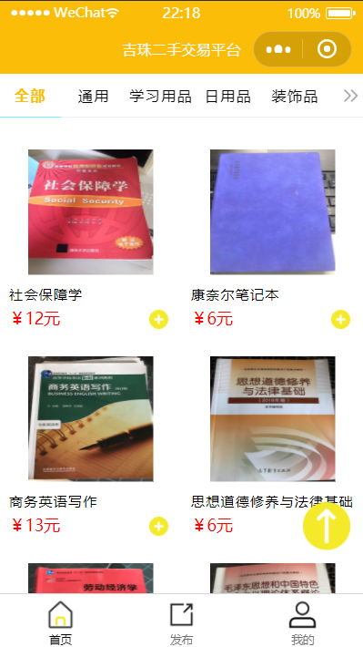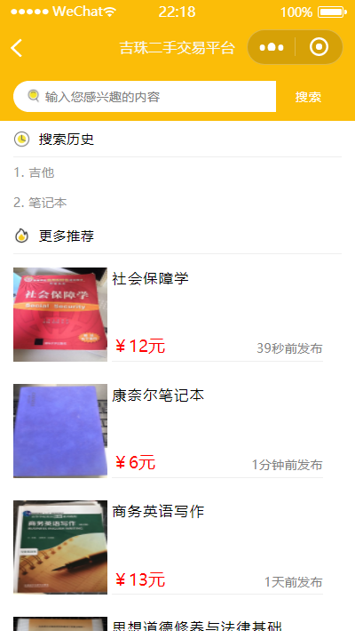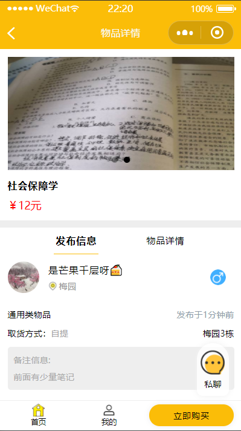

买卖双方**交易过程：**

1.买家购买商品：

买家购买商品后，如在线下收到商品，则可以通过确认收货通知卖家

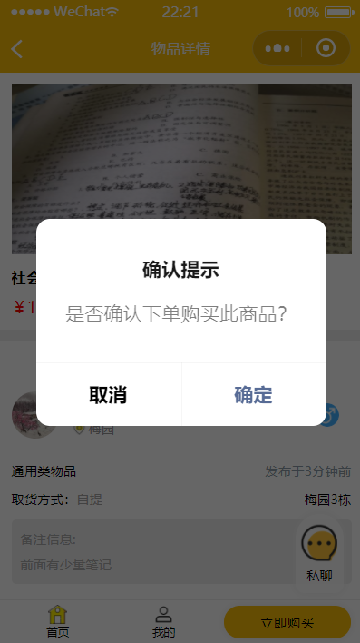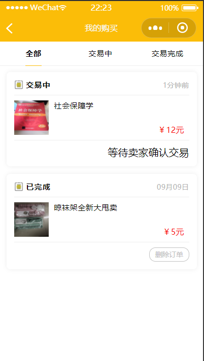

2.买家中止交易：

买家可以点击取消订单按钮中途取消交易，卖家会收到消息提醒。商品会自动上架。

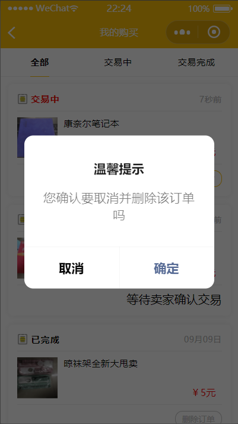

3.卖家中止交易：

卖家可中途中止交易。然后点击重新上架按钮，重新发布到首页展示。

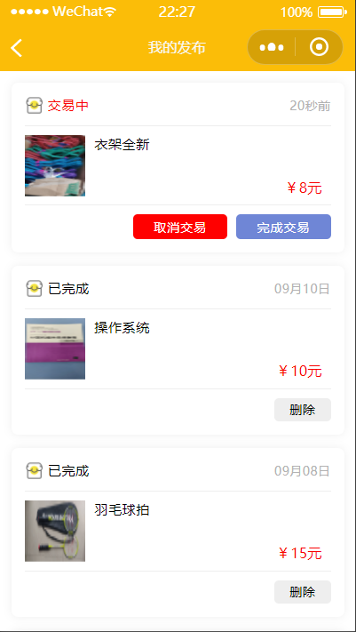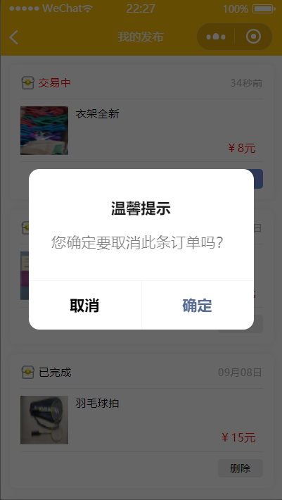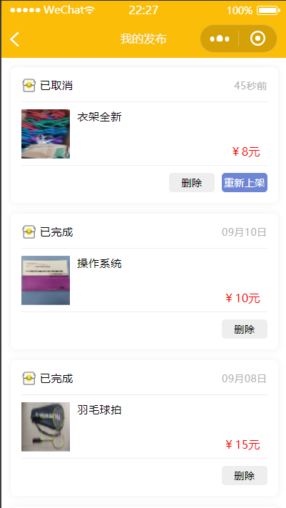

买家可在商品详情页点击‘聊天’与卖家沟通

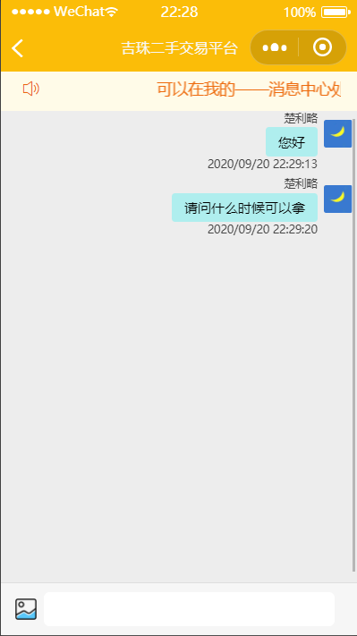

卖家可在个人主页消息中心中，看到买家的信息，进入聊天室与之交流。

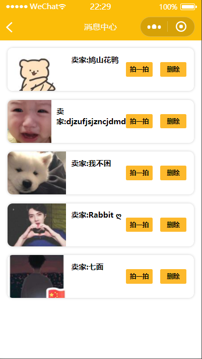

### 部署教程：

本小程序已经上线，可先预览：

## 一、小程序端

### 1、下载导入

直接下载到本地，然后导入开发者工具

> 小程序开发综合文档地址：https://developers.weixin.qq.com/miniprogram/dev/framework/

### 2、开通云环境

不罗嗦，这都是基础，直接看官方说明操作即可

> 云开发官方文档说明：https://developers.weixin.qq.com/miniprogram/dev/wxcloud/basis/getting-started.html

### 3、配置前端config

找到config.js文件，然后按照我写的注释更改为你自己的

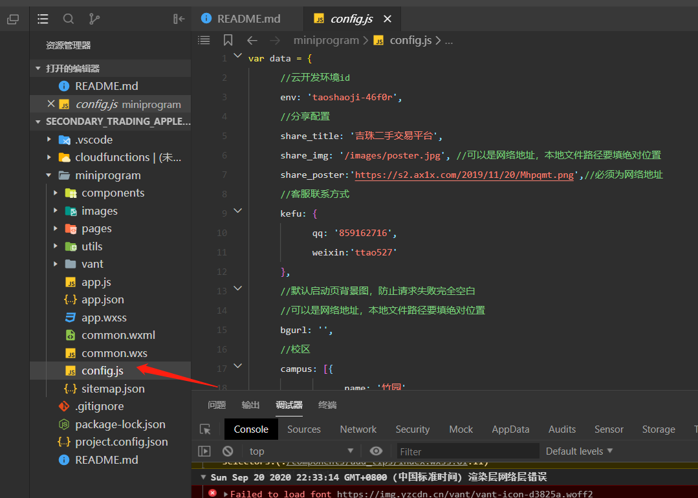

## 二、云函数

### 1、修改基础信息

每个云函数要修改的部分，我都捻出来放在了顶部，直接根据我做的注释信息进行修改，如下图所示

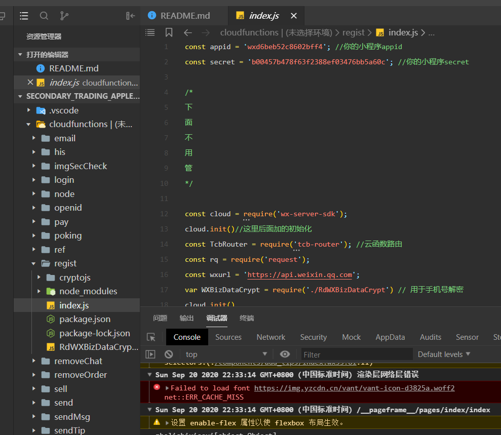

### 2、上传全部文件

挨个提交每个云函数，其中依赖包我已经一起上传了，无需再挨个本地去安装，直接上传所有文件即可

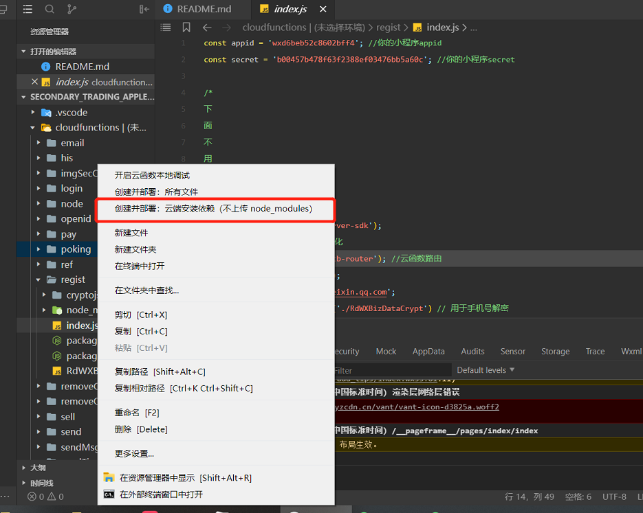

## 三、云开发数据库

### 1、创建集合 设置权限

分别创建下图所示的集合，然后将所有集合的权限设置为所有可读

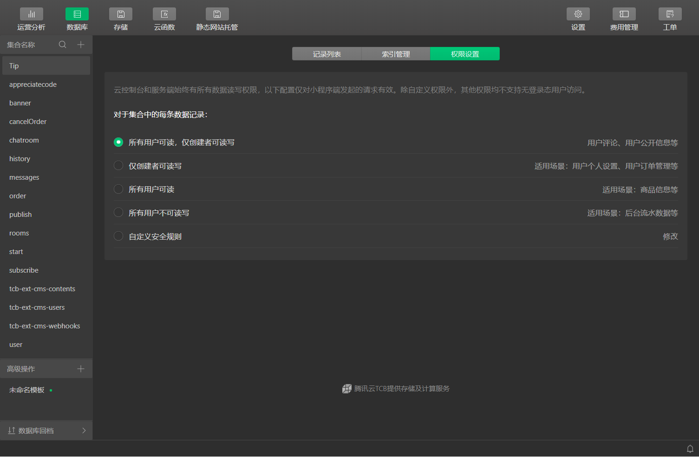

### 2、设置banner

#### ①在banner集合下新增一条记录

#### ②按照下图所示添加字段

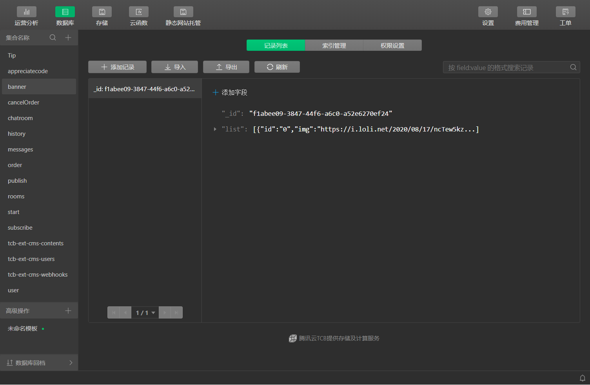

#### 补充说明

list数组下的img为图片地址，id为唯一区分字段，url为点击轮播后跳转的地址，这个地址必须为与此小程序关联的公众号文章或者为业务域名地址，如果没有就留空即可

### 3、设置启动页图片

#### ①在start集合下新增一条记录

#### ②按照下图所示添加字段

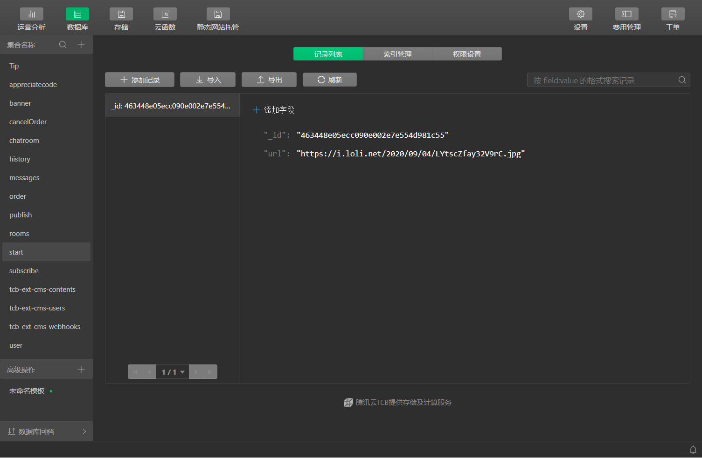

## 四、公众平台配置（小程序不上线则不需要执行此步骤）

### 1、设置基本信息

| 名称   | 配置                         |
| ------ | ---------------------------- |
| 类目   | 生活服务 > 环保回收/废品回收 |
| 基础库 | 2.4.3                        |

### 2、提交审核

审核页面路径：pages/index/index

### 3、设置在线客服

打开【设置】--【客服】--【添加】，绑定成功后，打开小程序【客服小助手】，状态设置为在线即可，到时候有客户咨询自动会推送到你的微信号上的

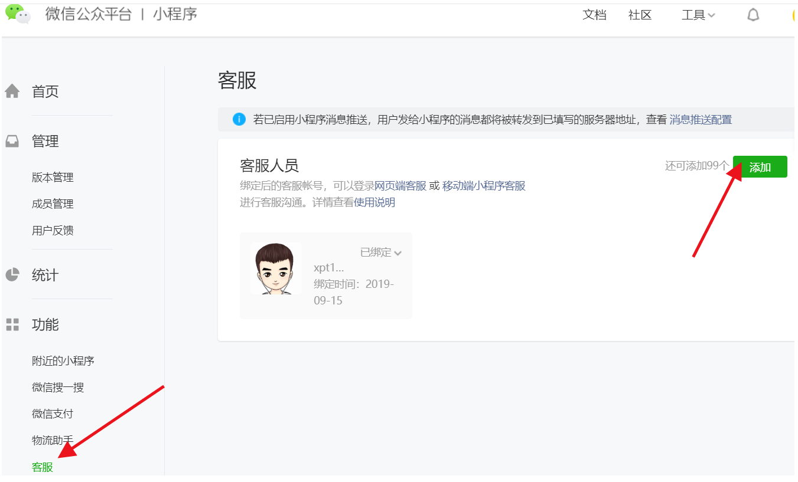

## 五、服务与反馈

#### 如果需要提供安装服务，直接联系我微信：ttao527  如果觉得对你有帮助可以支持一下！感谢！**（代码开源，但时间不“开源”，伸手党勿扰！）**

